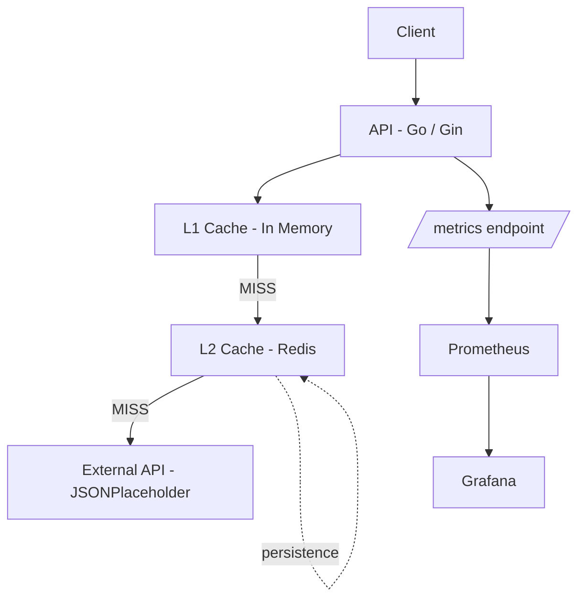

# Mini Edge API Platform

A lightweight Go API that simulates an edge/gateway layer with multi-layer caching (in-memory + external integration) and performance optimization.

The project focuses on reducing latency, improving request efficiency, and simulating real-world API gateway behavior.

---

## Overview

This project simulates an intermediate layer (API Gateway / Edge Server) responsible for:

- Reducing external API calls
- Improving response time via multi-layer caching (in-memory + external integration)
- Handling internal and external data sources
- Demonstrating concurrency-safe caching strategies in Go

---

## Technologies

- Go (Golang)
- Gin Web Framework
- net/http
- Redis
- sync.RWMutex (concurrency control)
- Go testing & benchmarking tools

---

## Architecture



Redis acts as a distributed cache layer to persist data across application restarts and multiple instances.

---

## Endpoints

### GET /health
Health check endpoint to verify service availability.

### GET /products
Returns a list of products (mock data).

Features:
- In-memory cache
- TTL-based expiration
- Reduces processing time on repeated requests

### GET /external-data

Acts as a proxy endpoint that fetches data from an external API (JSONPlaceholder) and applies a multi-layer caching strategy.

Features:

- Multi-layer caching (L1 in-memory + L2 Redis)
- Cache fallback strategy (L1 → L2 → external API)
- HTTP client injection (Dependency Injection)
- Reduced external API calls and improved latency
- Direct response streaming to the client
- Cache observability via `X-Cache` header (HIT / MISS / HIT-REDIS)

---

## Observability

This project includes a full observability stack using Prometheus and Grafana.

### Metrics exposed:

- HTTP request duration and count
- Cache hit/miss ratio
- Redis operations (hits, misses, writes)
- External API latency

### Tools:

- Prometheus scrapes `/metrics`
- Grafana visualizes system performance
---

## Cache System

The project uses a multi-layer caching strategy (in-memory + Redis optional persistence).

### Features:

- Thread-safe (`sync.RWMutex`)
- Key-value storage
- TTL expiration per entry
- Lazy eviction on access
- Background cleanup goroutine (optional)
- Redis integration for distributed caching (L2 layer)

### Cache behavior:

- HIT (L1 or L2) → returns cached response
- MISS → fetches data, stores in L2 (Redis) and L1 (memory)

---

## HTTP Headers

### X-Cache

Indicates response origin:

- `X-Cache: HIT` → served from cache
- `X-Cache: MISS` → fetched from source
- `X-Cache: HIT-REDIS → served from Redis cache (L2)

### Cache-Control

```http
Cache-Control: public, max-age=30
```
Allows client-side caching for 30 seconds.

---

## Benchmarks

Cache performance was measured using Go benchmarks:

| Benchmark                  | ns/op (avg) | B/op | allocs/op |
|--------------------------|------------|------|------------|
| Cache Get (Hit)          | ~23 ns/op  | 0 B  | 0 allocs   |
| Cache Get (Miss)         | ~17 ns/op  | 0 B  | 0 allocs   |
| Cache Set                | ~493 ns/op | 336 B| 3 allocs   |

### Performance Analysis

- **GET operations (Hit/Miss)** are extremely fast due to direct in-memory map access (O(1)), with minimal overhead and zero allocations.
- **SET operations** are more expensive because they involve memory allocations and map updates, which introduces additional latency and garbage collector pressure.
- The cache is optimized for **read-heavy workloads**, which is typical in edge/gateway architectures.
- Redis is used as a secondary cache layer to persist data across application restarts.

Overall, the results demonstrate a system designed for low-latency reads, where write cost is accepted as a trade-off for fast retrieval and simplicity of design.

---

### Project Structure
cmd/server
internal/api
internal/cache (in-memory cache)
internal/cache/redis (Redis implementation)
internal/handlers
internal/middleware
internal/routes

---

## How to run (API only)
```
go mod tidy
go run ./cmd/server
```
Server runs at:
```
http://localhost:8080
```
## How to run (full observability stack)
```
docker-compose up -d
```
Then run the API:
```
go mod tidy
go run ./cmd/server
```
## Local Services

### API
http://localhost:8080

### Observability

- Metrics (Prometheus format): http://localhost:8080/metrics
- Prometheus UI: http://localhost:9090
- Grafana Dashboards: http://localhost:3000
---

### Testing

Run unit tests:
```
go test ./internal/cache -v
```

Run benchmarks:
```
go test ./internal/cache -bench=. -benchmem
```
---

### Future improvements
- Cache based on query parameters
- Request timeout and retry strategy
- Structured logging (structured JSON logs)
- Redis cluster / high availability setup
- Cache invalidation strategies
- Grafana dashboards for cache hit ratio and latency visualization
- LRU eviction policy for in-memory cache optimization

---

## Purpose

This project was built for learning and demonstrating:

- Backend architecture design
- Multi-layer caching strategies simulating edge/gateway behavior
- Concurrency management in Go
- Dependency injection and modular design
- Performance analysis with benchmarks

---

### Author

Fernanda Ishida
