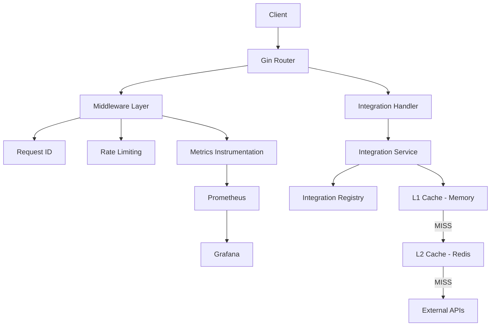

# Mini Edge API Platform

The Mini Edge Integration Platform is a backend system designed to orchestrate external service integrations through a modular and observable architecture.

It implements multi-layer caching, request tracing, and metrics instrumentation to optimize request handling and improve system visibility under load.

The system is built with concurrency-safe components and follows a service-oriented structure inspired by real-world API gateway patterns.

---

## Purpose

The system is designed to:

- Orchestrate external API integrations through a unified interface
- Reduce external dependency latency using multi-layer caching (L1 + Redis)
- Provide observability through metrics and structured tracing
- Demonstrate scalable backend architecture patterns in Go

---

## Technologies

**Core**:
- Go (Golang)
- Gin Web Framework

**Data & Performance:**
- Redis — distributed caching (L2)
- sync.RWMutex — concurrency-safe in-memory cache
- net/http — external API communication

**Observability:**
- Prometheus — metrics collection (latency, cache, integrations)
- Grafana — dashboards for performance and system observability

**Engineering validation:**
- Go testing & benchmarking tools

---

## Architecture



The platform follows a layered architecture where requests pass through middleware responsible for tracing, rate limiting, and metrics instrumentation before reaching the integration orchestration layer.

The Integration Service centralizes external communication, caching behavior, and integration routing through a registry-based approach.

Caching is implemented using a multi-layer strategy:
- L1: low-latency in-memory cache
- L2: Redis distributed cache

Observability is integrated through Prometheus metrics and Grafana dashboards, enabling visibility into request latency, cache efficiency, and external API performance.

---

## Endpoints

### GET /health
Health check endpoint used to verify service availability and API responsiveness.

Example:

`GET http://localhost:8080/health`

Response:

```
{
  "status": "ok"
}
```

---

### GET /integrations/:name

Executes a registered external integration through the integration service layer.

The request passes through:

- middleware instrumentation
- request tracing
- rate limiting
- multi-layer caching (L1 + Redis)
- integration orchestration

Supported integrations are managed through a registry-based architecture.

Example:

`curl http://localhost:8080/integrations/github`

#### Response headers:

X-Cache: HIT
X-Request-ID: 8c3d1e7f...

#### Cache behavior:

- `HIT` → served from in-memory cache
- `HIT-REDIS` → served from Redis cache
- `MISS` → fetched from external API

#### Example integrations currently available:

- github
- pokemon
- weather
- exchange
---

### GET /metrics

Prometheus-compatible metrics endpoint used for observability and monitoring.

#### Metrics include:

- HTTP request latency
- Request throughput
- Cache hit/miss ratio
- Redis operations
- External API duration metrics

Example:

`GET http://localhost:8080/metrics`

---
## Observability

The platform exposes Prometheus-compatible metrics through the `/metrics` endpoint, enabling visibility into request behavior, cache efficiency, and integration performance.

### Metrics

- HTTP request count and latency
- Cache hit/miss ratio (memory + Redis)
- Redis operation metrics
- External API duration metrics
- Integration execution visibility

### Tracing

- Request ID propagation through middleware
- Correlated logs across handlers and services
- `X-Request-ID` response header support

---

## Cache System

The platform implements a multi-layer caching strategy designed to reduce latency and minimize external API dependency during integration execution.

### Features

- Thread-safe in-memory cache using `sync.RWMutex`
- Redis distributed cache layer (L2)
- TTL-based expiration
- Lazy eviction on access
- Background cleanup goroutine
- Cache warm-up after Redis hits

### Cache Strategy

- L1 (memory) prioritizes low-latency access
- L2 (Redis) enables distributed cache sharing across instances
- Cache misses trigger external API requests and cache population

### Cache Flow

- HIT → served from in-memory cache
- HIT-REDIS → served from Redis cache and promoted to L1
- MISS → external API request followed by cache population
---

## HTTP Headers

### X-Cache

Indicates where the response was served from:

- `HIT` → in-memory cache (L1)
- `HIT-REDIS` → Redis cache (L2) 
- `MISS` → external API request

### X-Request-ID

Used for request tracing and log correlation across the request lifecycle.

---

## Benchmarks

Benchmarks were executed to validate cache access performance and evaluate read/write overhead under concurrent access scenarios.

| Benchmark                  | ns/op (avg) | B/op | allocs/op |
|--------------------------|------------|------|------------|
| Cache Get (Hit)          | ~23 ns/op  | 0 B  | 0 allocs   |
| Cache Get (Miss)         | ~17 ns/op  | 0 B  | 0 allocs   |
| Cache Set                | ~493 ns/op | 336 B| 3 allocs   |

### Performance Analysis

- Cache read operations are optimized for low-latency access with zero allocations
- Write operations involve memory allocation and synchronization overhead
- The cache design prioritizes read-heavy workloads common in gateway and integration systems
- Redis operates as a secondary distributed cache layer for resilience and shared cache access

The benchmark results demonstrate a system optimized for fast retrieval and reduced external dependency usage.

---

## Project Structure

```text
.
├── cmd/
│   └── server/
│       └── application entrypoint
│
├── internal/
│   ├── api/
│   │   └── handlers/
│   │       └── HTTP handlers and request processing
│   │
│   ├── cache/
│   │   └── in-memory and Redis cache layers
│   │
│   ├── integrations/
│   │   └── external integration orchestration
│   │
│   ├── metrics/
│   │   └── Prometheus metrics instrumentation
│   │
│   └── middleware/
│       └── request lifecycle middleware
│           ├── rate limiting
│           ├── tracing
│           └── metrics
│
├── docker-compose.yml
│   └── observability stack services
│
├── go.mod
│
└── README.md
```

---

## Running the Project

### API
```
go mod tidy
go run ./cmd/server
```
Server runs at:
```
http://localhost:8080
```
## Full Observability Stack
```
docker-compose up -d
```
Then run the API:
```
go mod tidy
go run ./cmd/server
```
---
## Local Services

### API
http://localhost:8080

### Observability

- Metrics (Prometheus format): http://localhost:8080/metrics
- Prometheus UI: http://localhost:9090
- Grafana Dashboards: http://localhost:3000
---

### Testing

Run unit tests:
```
go test ./internal/cache -v
```

Run benchmarks:
```
go test ./internal/cache -bench=. -benchmem
```
---

### Future improvements

- Circuit breaker strategy for external integrations
- OpenTelemetry distributed tracing
- Structured logging with contextual request tracing
- Integration health monitoring
- Dynamic integration registration
- Retry and timeout strategies for external services
- Advanced cache key strategies for query-aware caching
- Advanced cache eviction strategies (LRU/LFU)
- Redis high-availability and clustered deployment support
- Advanced observability dashboards for integration and cache analytics
- Per-integration performance analytics

---

### Engineering Focus

This project applies backend engineering practices including:

Integration orchestration patterns
Multi-layer caching strategies
Concurrency-safe system design
Metrics instrumentation and observability
Modular service-oriented architecture
Performance analysis and benchmarking
API gateway-inspired request flow design

---

### Author

Fernanda Ishida
